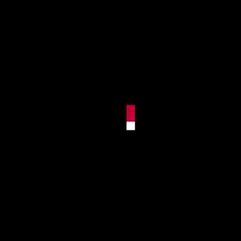
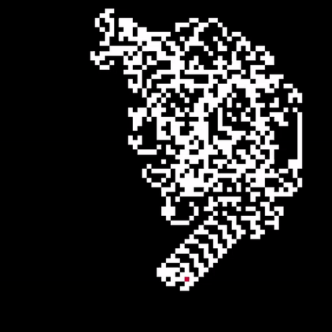
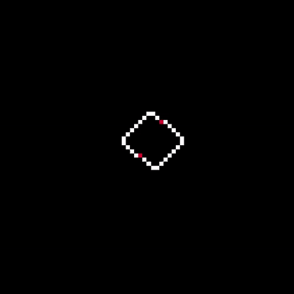

# Langton's Ant

View the [live version]![live]

#### Rules

Ants have simple rules. Each iteration, an ant will:
  0. Turn right for a white square, left for black
  0. Flip the color of the square
  0. Move forward one space

#### Behavior

Ants exhibit some incredible behavior:
  0. Ants are deterministic. The same initial conditions will always lead to the same ending.
  0. Some configurations are oscillatory. The ants will repeat their steps forever.

  
       
  

  0. Some configurations are emergent. The ant(s) will generate a recurrent pattern and proceed indefinitely in one direction.

  
  

[live]: https://ryanrhall.github.io/langtons-ant/
